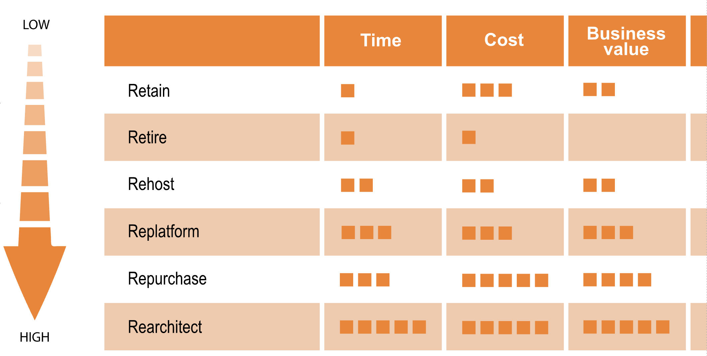

# Ordina Cloud Solutions
More and more organisations are moving their IT operations and infrastructure to the cloud for a big variety of reasons. Some of these are:
- Increasing operational excellence for products or services
- IT infrastructure and operations cost reduction
- Increase of market share
- Faster time to market of new features, products or services
- Increase IT flexibility to faster act on market changes 

Is your organisation looking for any of these reasons, or any that apply for you? In that case a cloud migration or adoption strategy can help you in reaching these goals. Moving to the cloud, or increasing the value gained from it if your organisation has already moved there, can be a long and complex process. Ordina excells in supporting organisations with this process due to the experience and knowledge of our experts.

| Testimonial 1 | Testimonial 2 | Testimonial 3 |
|:-------------:|:-------------:|:-------------:|
||||

## Why Ordina
We are a 1-stop shop that can supply experts from A-Z in the process, executing and retaining **your organisation's** cloud migration or adoption by supplying:
- High Performance Teams
- Architects
- Cloud strategy​
- Cloud Move Solution​
- AZURE/AWS Knowledge​
- Partner Microsoft​
- Secure by design​
- MVP’s​
- References
- ...

Happy Customer X
> It's amazing. We had no idea what we were getting ourselves into with this cloud stuff. However, in only two workshops with Ordina, we had devised a strategy that would have moved all our IT infrastructure to the cloud in two years which aligns with our business goals.

## Determining your cloud strategy
In order for your organisation to determine the cloud strategy that aligns with your business goals, a strategy will be defined in a value discovery project. During this phase, our experts will define the exact details of the current situation and the outcome. They will get in contact with the stakeholders and investigate a.o. the current IT infrastructure, organigram, budget and return of investment. Some deliverables of this value discovery can be:
- Cloud strategy defining vendors, public, private or on premise deployment
- Alignment of goals from all stakeholders
- Application portfolio
- Budget, cost and resource planning
- Migration plan

## Executing your cloud strategy
|||
|---|---|
|Based on the assembled application portfolio and business goals from value discovery workshops, it is time to actually execute your organisation's cloud strategy. In essence, for every application or solution will be determined how it fits best in your cloud strategy.||
||Our experts, ideally working in High Performance Teams, adhere to an agile way of working while executing your cloud strategy. This way, they are constantly in contact with the business to deliver and steer the execution, able to measure progress while doing so.|[logo](./img/ordina-logo.jpeg)|
|Deliverables don't necessarily have to be completed products. Anything in between will also be delivered, measured and tested to be as (cost)efficient as possible.||

## Migrating to your cloud strategy
Moving to your determined cloud strategy means that there will be a hybrid situation in between your current and future IT infrastructure and processes. Our experts calculate this situation into the cloud strategy. By doing so, they will keep your IT operations running and minimally impacted as hardware, software and data might be shifting around.

## Maintaining your cloud strategy
It is often assumed that after having moved to the cloud by having executed a strategy, the IT infrastructure and processes are in place and can be left alone, needing only minor corrective maintenance. This is far from the truth. It is always necessary to keep performance metrics, software updates, and log analysis going in order to maintain and invest in the continuity of your IT operations. Also, a cloud can provide new features and services that might be beneficial for your business.        